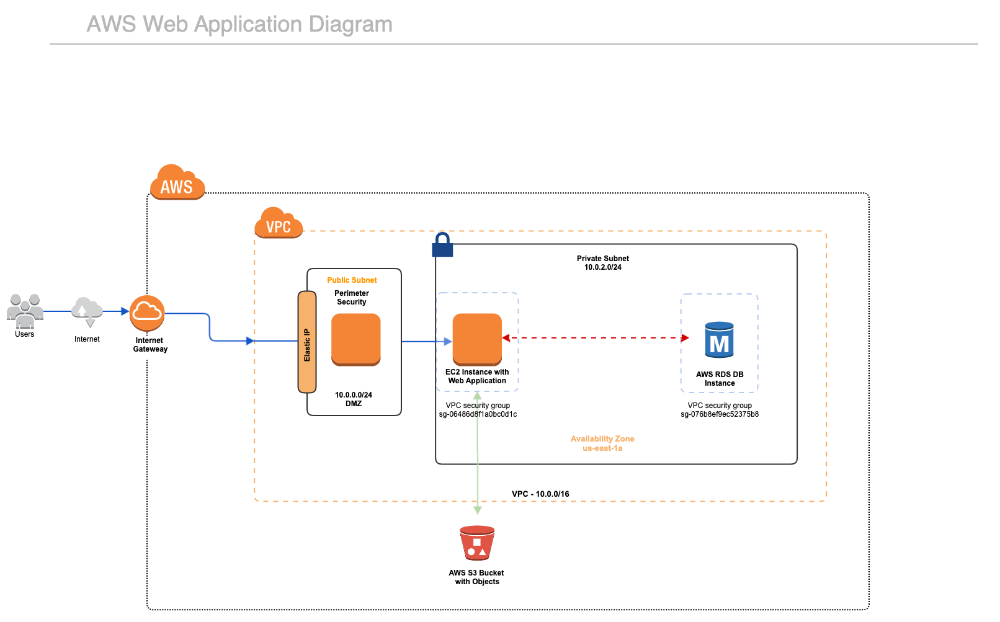

# Panorama Annotator
 
Click [HERE](http://ec2-3-93-172-10.compute-1.amazonaws.com/panorama-annotator/app/index.html) to open the application! :round_pushpin:	
## Функционалности:
Платформата предоставя на потребителите голямо разнообразие от функционалности:
1.	Разглеждане на 360 градусови анотирани панорамни снимки<br/>
Panorama annotator предоставя възможност на потребителите да разглеждат панорамни снимки. Потребителите могат да разглеждат анотации върху панорамни снимки както и да завъртат снимките на 360 градуса.
2.	Добавяне на анотация към панорамни снимки<br/>
Потребителите могат да генерират пинове(анотации) върху панорамни снимки с помощта на един клик.
3.	Редактиране на анотация<br/>
Потребителите могат да редактират вече генерирани пинове(анотации) върху панорамна снимка.
4.	Изтриване на анотация<br/>
Потребителите могат да изтриват създадени пинове(анотации) върху панорамни снимки.
5.	Споделяне на анотация чрез URL<br/>
Системата предоставя възможност за споделяне на създадени анотации с други потребители чрез URL на анотацията.
6.	Сканиране на QR code на споделен пин/анотация<br/>
Системата предоставя възможност за визуализиране на споделен пин чрез сканиране на QR code на дадената анотация.
7.	Поддръжка на HTML анотации върху панорамна снимка<br/>
Системата предоставя възможност на потребителите да украсяват генерирани пинове. Потребителите могат да добавят HTML и CSS по тяхно желание към анотации.
8.	Импорт на анотации в JSON формат<br/>
Системата предоставя възможност на импорт-ване(качване и зареждане) на анотации под формата на JSON текст или файл.
9.	Експорт на анотации в JSON формат<br/>
Системата предоставя възможност на потребителите да могат да запазват съществуващи анотации върху панорамна снимка под формата на JSON файл.

## Aрхитектура на приложението


# Как да изпълня системата локално?
Предварителни изисквания:<br/>
    Преди да изтеглите приложението, трябва да имате инсталиран и стартиран LAMP стек на вашата машина. 
    В противен случай, може да използвате следните стъпки за инсталация на Linux.<br/>
За целта е нужно да инсталирате ресурсите под формата на zip, да ги разархивирате и в последствие да ги преместите в `/var/www/html` директорията на вашата машина.
- Втори вариант за инсталация е да клонирате ресурсите във вашата `/var/www/html` директория с помощта на командата:
```
git clone git@github.com:gyokkoo/panorama-annotator.git
```
Преди да запалите приложението в браузъра ви, трябва да се уверите че имате стартиран Apache демон. Ако не сте го направили използвайте следната команда, за да го направите:
```sudo systemctl apache2 start``` или ```sudo service apache2 start```.
Конфигурирайте базата изпълнявайки следния SQL код (файл `config-database.sql`)

```
CREATE DATABASE panorama;

CREATE TABLE `annotations-table` (
  `id` varchar(120) NOT NULL,
  `latitude` double NOT NULL,
  `longitude` double NOT NULL,
  `tooltip` text NOT NULL,
  `panoramaImage` text NOT NULL,
  `annotationImage` text NULL,
  `html` text NULL,
  `style` text NULL,
  `content` text NULL
) ENGINE=InnoDB DEFAULT CHARSET=utf8mb4;
```

След като се уверите, че имате всички настройки описани в тази секция от документа навигирайте до следния адрес в браузъра ви:
 ```
 localhost/panorama-annotator/app/index.html
 ```
